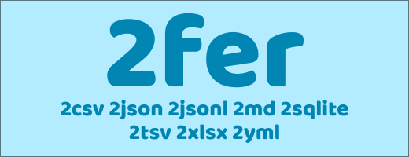

[](https://github.com/gurgeous/2fer/actions/workflows/ci.yml)



# 2fer

`2fer` is a small CLI for converting csv-like files between many common file formats.

- csv, tsv (also csv with pipe or semi delims)
- json or jsonl
- markdown
- sqlite (requires `sqlite3`)
- xlsx
- yaml

### Important Features

- includes support for things like sqlite and markdown
- the handy symlinks (2csv, 2json, 2jsonl, 2md, 2sqlite, 2tsv, 2xlsx, 2yml)
- infers input format using heuristics or input filename
- infers output format from handy symlink name or output filename
- infers numeric types for conversion like csv => json

Example usage:

```sh
cat input.csv | 2md > output.md      # csv => md
cat input.yml | 2fer -o output.json  # yml => json
```

This is silly but it shows the power of 2fer:

```sh
$ cat test.csv | 2sqlite | 2yml | 2md
```

Will output markdown:

```
| carat | cut     | depth | table | z    |
| ----- | ------- | ----- | ----- | ---- |
| 0.23  | Ideal   | 61.5  | 55    | 2.43 |
| 0.21  | Premium | 59.8  | 61    | 2.31 |
| 0.23  | Good    | 56.9  | 65    | 2.31 |
| ...   | ...     | ...   | ...   | ...  |
```

### Install

#### Brew/macOS

```sh
$ brew install gurgeous/tap/2fer
```

#### Linux tarball

Download an archive from https://github.com/gurgeous/2fer/releases. Copy the
binary and symlinks into your `PATH`. I like to use `~/.local/bin`. Optional
bash/zsh completions are in `extra/`.

#### Build from source

```sh
cargo install --path .
```

That installs `2fer` only. If you want the short commands too:

```sh
cd ~/.cargo/bin
for name in 2csv 2json 2jsonl 2md 2sqlite 2tsv 2xlsx 2yml; do
  ln -sf 2fer "$name"
done
```

### Options

```
Usage: 2fer [OPTIONS] [file]

Arguments:
  [file]  Read from this file, otherwise use stdin

Input:
  -d, --delim <char>  Set the input delimiter when reading CSVs
      --table <name>  Pick the sqlite table for read or write
      --vanilla       Disable numeric formatting (for csv => json and similar)

Output:
  -o, --output <file>  Write output to this file, otherwise we use stdout
      --as <format>    Select output format
      --compact        Leave null fields out of json, jsonl, and yml
```

### Changelog

0.1.0 (July '26)

- first release
